# studentlifeproject# Student Life Tracker
Student Life Tracker is **a command-line Python application** designed to help students manage their daily academic and personal activities.

The program allows users to record and track:

1. Student sessions

2. Assignments

3. Expenses

4. Habits

5. Weekly Summaries

## Table of content

- [Features](#features)
- [How to run the program](#how-to-run-the-program)
- [Testing Summary](#testing-summary)
- [Team Members](#team-members)

## Features

- Menu-based navigation system

- Add, view, update and delete study sessions

- Assignment tracking with completion status

- Expense tracking with formatted VND currency display

- Habit tracking and progress counting

- Weekly summary combining multiple data categories

- Persistent data storage using a JSON file

- Input validation to prevent invalid or unexpected user input

  
## How to run the Program

  
**Requirements**

- Python 3.13.7 or lastest version

**Steps**

If you don't have **Python3** on your computer:

1. Download **Python 3 Installer** from link : [Click here](https://www.python.org)

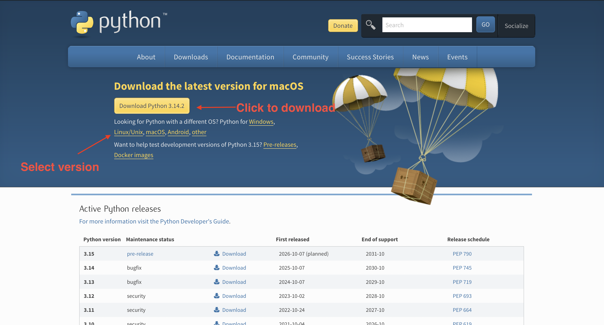

---
2. Open **Installer** and click **Install Python**
 
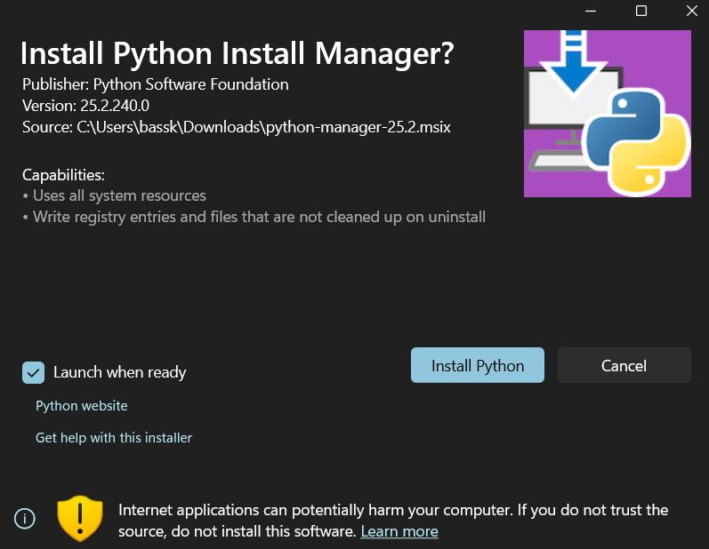

---
3. Type **"Y"** and press Enter

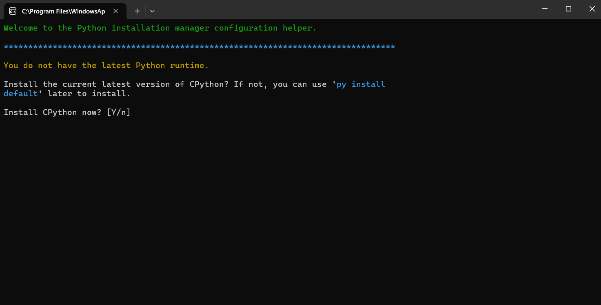

---
4. Type **"Y"** if you want to view online help or type **"N"** to close windows and end installation.
   
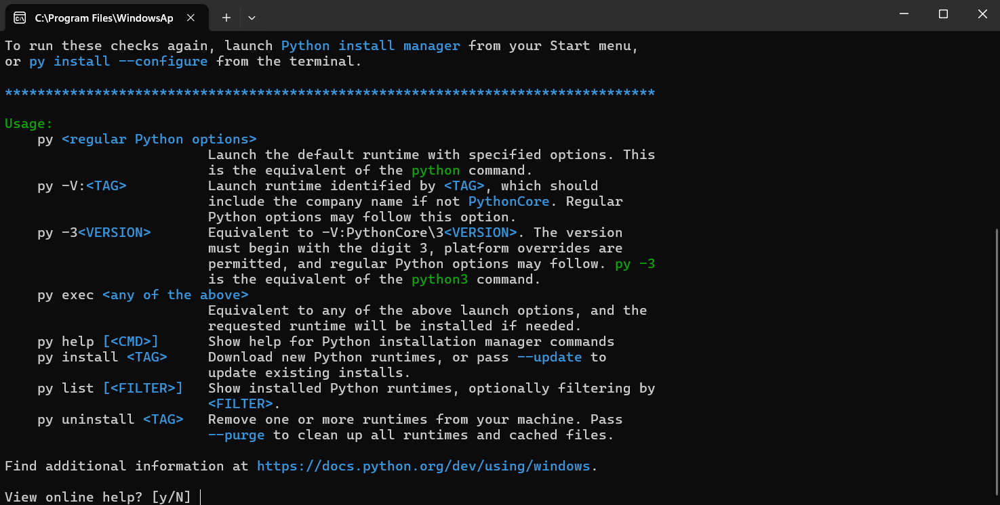  

---
If you have **Python3** on your computer already:

1. Open **Command Prompt (Windows)** or **Terminal (MacOS)**

For MacOS :

1. Press **Command key (⌘) + Space Bar** to open Sportlight search
2. Type **"Terminal"** and press Enter

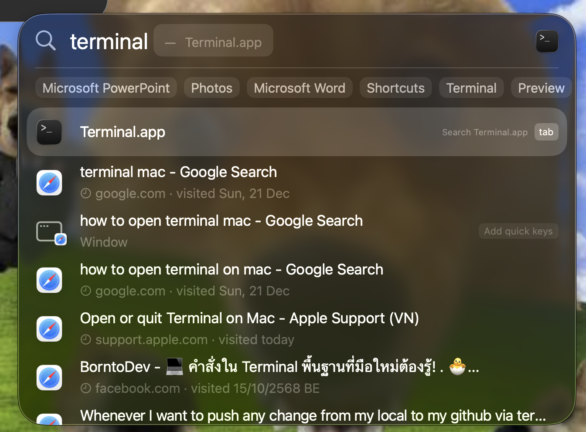
*Figure 1: How to open Termilnal on MacOS

---
For Windows : 

1. Press **Windows** to open Menu
2. Type **"cmd"** and press Enter

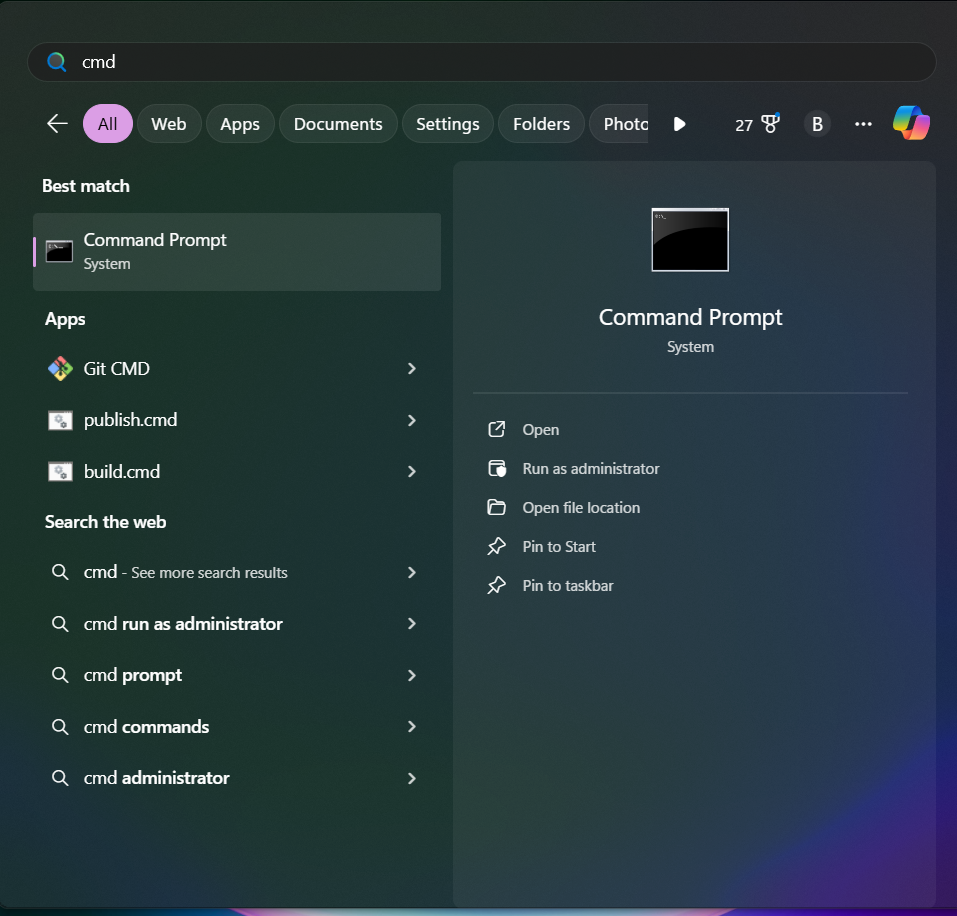
*Figure 2: How to open Command Prompt on Windows 11

---
2. Download the project

Download by Git enter this command:

```
git clone https://github.com/basschatchawan13327/studentlifeproject.git
```

or

Download by GitHub Website

Click on the **green button "<> Code"** and **download as zip** or [Click here](https://github.com/basschatchawan13327/studentlifeproject/archive/refs/heads/main.zip) 

3. Navigate to the project directory.
```
cd studentlifeproject
```

5. Run the program using the following command:
```
python3 StudentLifeTracker.py
```
  
(The data file **"student_life.json"** will be created automatically if it does not already exist.)

  
## Testing Summary

- **Main Menu**
  
  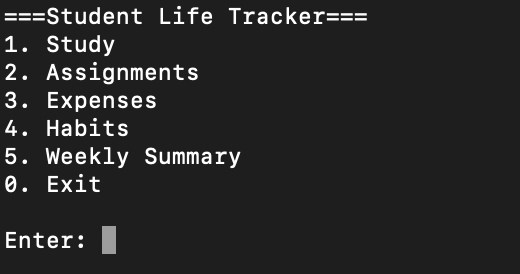

- **Study Session Function**
  
  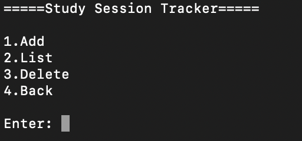
  
    - **Add**
      
      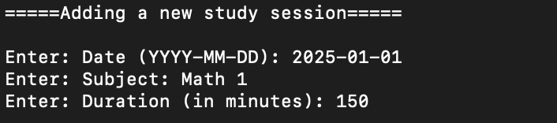
      
    - **List**
      
      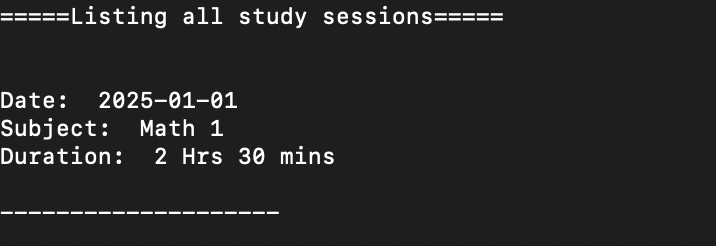
      
    - **Delete**
      
      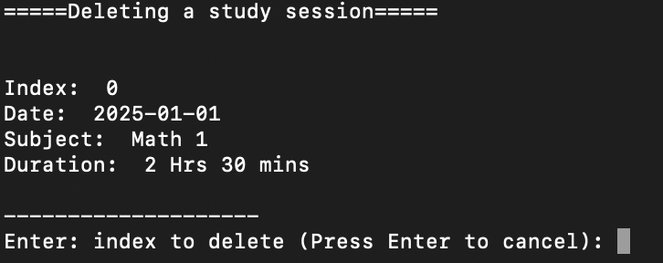
      
- **Assignment Function**
  
  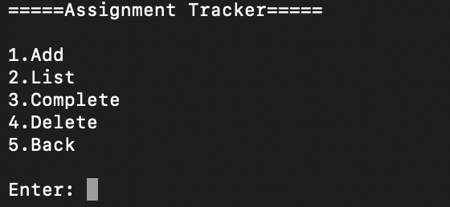
  
    - **Add**
      
      
      
    - **List**
      
      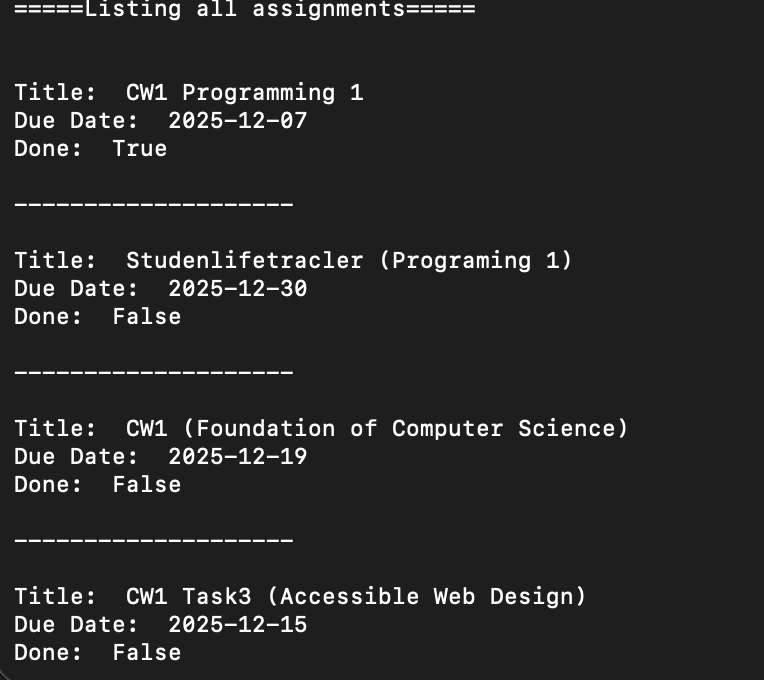
      
    - **Done**
      
      
      
      Select the index to mark as done :
      
      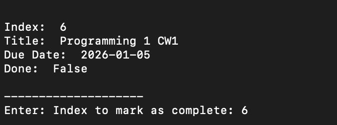
      
      Result :
      
      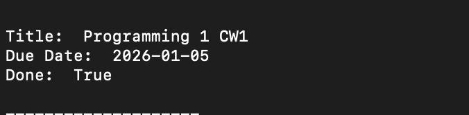
      
    - **Delete**
      
      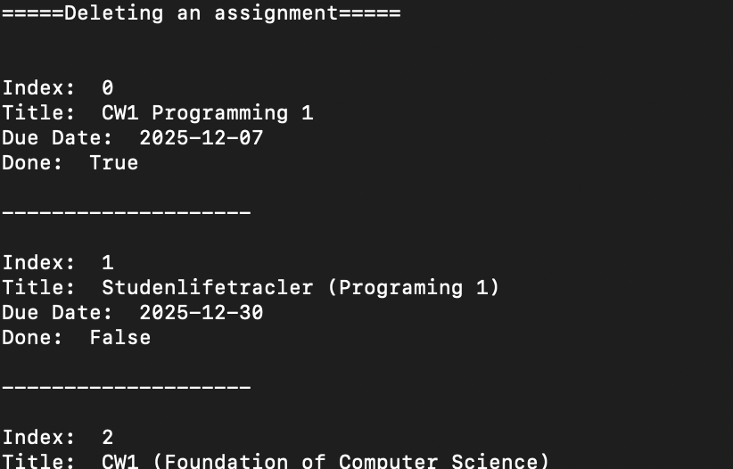
      
      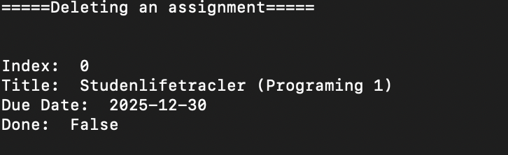
      
- **Expenses Function**
  
  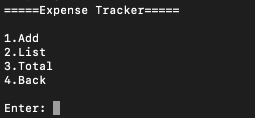
  
    - **Add**
      
      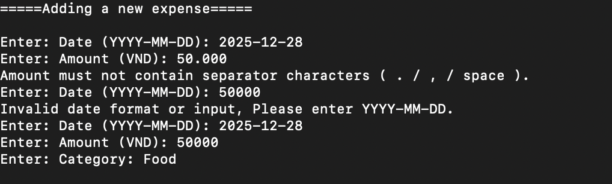
      
    - **List**
      
      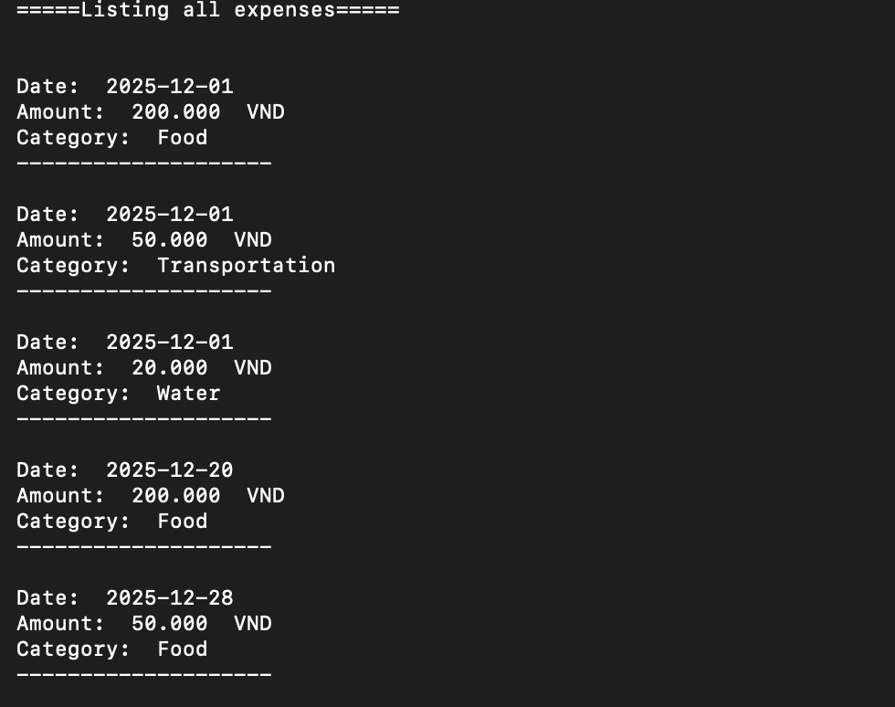
      
    - **Total**
      
      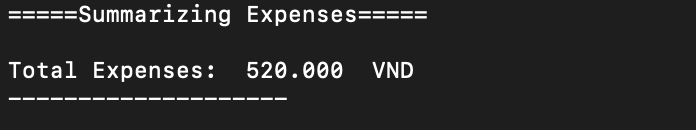
      
- **Habits Funtion**
  
  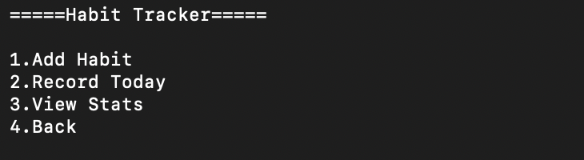
  
    - **Add**
      
      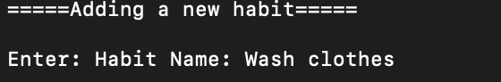
      
    - **Record**
      
      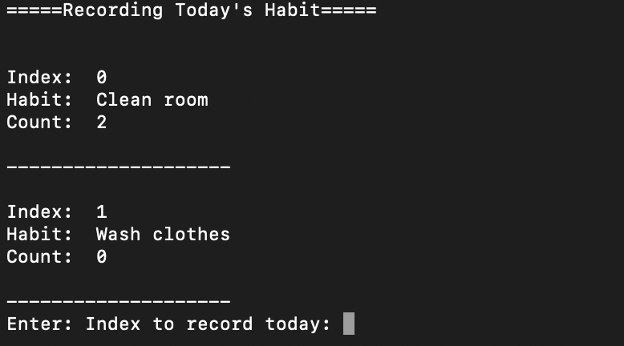
      
    - **View Stats**
      
      
      
- **Weekly Summaries**
  
  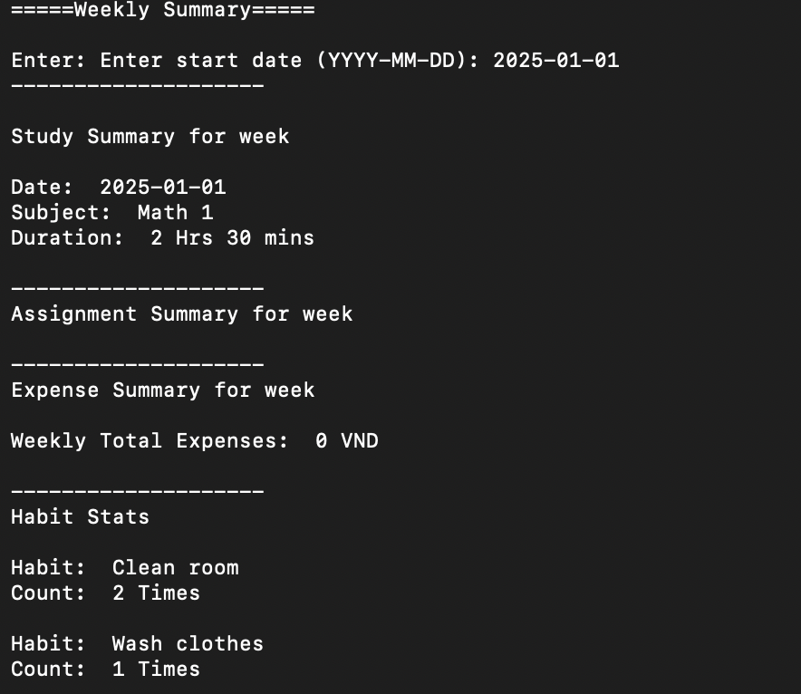

## Team Members

- Chatchawan Jiamprasut **(Project Leader)**
- Truong Gia Khanh **(Collaborator 1)**
- Tran Nguyen Kim Thuy **(Collaborator 2)**
